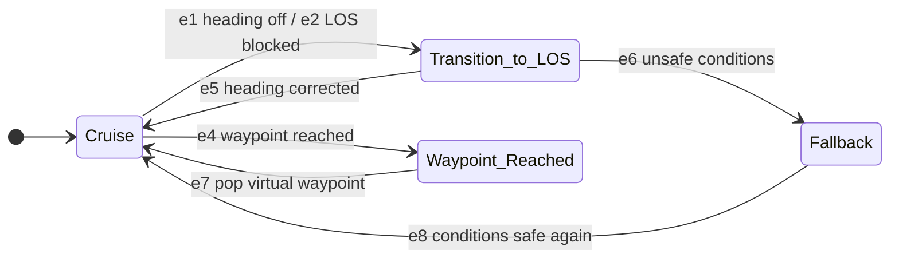

# colav-automaton

[](https://pypi.org/project/colav-automaton)
[](https://pypi.org/project/colav-automaton)

-----

| Field         | Value        |
|---------------|--------------|
| Last Updated  | 2026-08-10   |
| Version       | 1.0.0        |

## Overview

`colav-automaton` is a maritime **col**lision **av**oidance hybrid automaton, built on the [hybrid-automaton](https://github.com/rymc-dev/hybrid-automaton) framework. It steers an autonomous surface vehicle (USV) toward a goal waypoint while avoiding a dynamically-updatable **unsafe region** (a risk envelope), generating temporary "virtual" avoidance waypoints on the fly rather than requiring a pre-planned path.

This is not a full COLREGs rule-engine (it doesn't encode give-way/stand-on role logic for head-on, crossing, or overtaking encounters) - it's a general risk-envelope-avoidance automaton. Feed it any polygon as an unsafe region (a static hazard, a buffered obstacle, a COLREGs-derived exclusion zone computed upstream, etc.) and it will route around it.

**Framework Status**: v1.0.0 - Stable API, tested against real `hybrid-automaton>=1.0.0`, ready for simulation use and ROS2 integration testing on hardware.

If you have ideas for improvement or want to contribute, please reach out and become a collaborator!

## Table of Contents

- [colav-automaton](#colav-automaton)
  - [Overview](#overview)
  - [Table of Contents](#table-of-contents)
  - [How It Works](#how-it-works)
  - [Installation](#installation)
  - [Usage](#usage)
  - [Practical Use Cases](#practical-use-cases)
  - [Collaborators](#collaborators)
  - [License](#license)

## How It Works

The automaton has 4 discrete states, driven by the agent's continuous state `[x, y, theta, velocity, yaw_rate]`:



- **Cruise** - holds heading/speed toward the current waypoint.
- **Transition_to_LOS** - actively corrects heading using line-of-sight (LOS) guidance. Entered either because the heading has drifted out of tolerance, or because `los_clear_to_waypoint_guard` found the direct path to the waypoint blocked by the unsafe region - in that case a **virtual waypoint** is generated (an offset around the nearest visible edge of the unsafe region) and pushed onto the waypoint stack ahead of the real goal.
- **Fallback** - entered if the agent's safety-radius circle starts intersecting the unsafe region while turning. Holds current heading/velocity (no active re-planning while too close to danger) until the safety circle clears, then returns to Cruise.
- **Waypoint_Reached** - a terminal-ish state hit whenever any waypoint (virtual or goal) is reached within an acceptance radius. If virtual waypoints remain queued, the most recent one is popped and the agent resumes toward the next; otherwise the run ends.

Every guard has a corresponding flowchart and input/output truth table under [`docs/guards/`](./docs/guards/), and the shared `ctx: RuntimeContext` data contract used by every guard/reset/invariant/dynamics function is documented in [`docs/architecture/shared_context_data_table.md`](./docs/architecture/shared_context_data_table.md).

## Installation

```console
pip install colav-automaton
```

## Usage

```python
import asyncio
import numpy as np

from colav_automaton import ColavAutomaton
from hybrid_automaton import Automaton, RunResult, ContinuousState, AuxiliaryState

ha: Automaton = ColavAutomaton(
    heading_tolerance=0.2,
    constant_velocity=2.0,
    safety_radius=30.0,
    acceptance_radius=5,
)

async def run():
    results: RunResult = await ha.activate(
        initial_continuous_state=ContinuousState(
            name="agent_state",
            x0=np.array([0.0, 0.0, 0.0, 0.0, 0.0]),
            x_labels=["x", "y", "theta", "velocity", "yaw_rate"],
        ),
        initial_auxiliary_states=[
            AuxiliaryState(name="waypoints", aux0=[180.0, 140.0], aux_buffer_len=10),
            AuxiliaryState(
                name="unsafe_region",
                aux0=[[40.0, 20.0], [80.0, 20.0], [80.0, 60.0], [40.0, 60.0]],
                aux_buffer_len=10,
            ),
        ],
        delta_time=0.1,
        enable_real_time_mode=False,
        enable_self_integration=True,
        should_write_logs=True,
        output_dir="./colav-automaton-logs",
    )
    print(results)

asyncio.run(run())
```

A runnable version of this (with a few example scenarios) is in [`scripts/run_demo_scenario.py`](./scripts/run_demo_scenario.py).

## Practical Use Cases

**Is this ready for real-world use?** As of v1.0.0 it's ready for simulation and ROS2 integration/hardware-in-the-loop testing - it hasn't yet been validated on a physical vessel.

### Key Applications

- **🚢 USV Navigation** - the original motivating use case: risk-envelope-aware waypoint following for unmanned surface vehicles.
- **🛰️ ROS2 Integration** - built on `hybrid-automaton`'s ROS2-ready design; unsafe regions and waypoints are just `AuxiliaryState` updates, so they can be wired to a live perception/mapping stack.
- **🎓 Research & Education** - hybrid systems / marine autonomy coursework, COLREGs-adjacent research (see [Roadmap](./ROADMAP.md) for planned rule-category work).

### What's Deliberately Out of Scope (for now)

See [`ROADMAP.md`](./ROADMAP.md) for the full list - notably, this package does not (yet) implement COLREGs give-way/stand-on rule logic, only generic unsafe-region avoidance.

## Collaborators

This project was created by:
- **[Ryan McKee](https://github.com/rymc-dev)**

### Contributing

Please open an issue or pull request on [GitHub](https://github.com/rymc-dev/colav-automaton).

### Citation

Please cite this package as described below if used in research:

```bibtex
@misc{colav_automaton_2026,
  author       = {Ryan McKee},
  title        = {colav-automaton v1.0.0},
  howpublished = {GitHub repository},
  year         = {2026},
  note         = {Accessed: Aug. 10, 2026},
  url          = {https://github.com/rymc-dev/colav-automaton}
}
```

## License

`colav-automaton` is distributed under the terms of the [MIT](https://spdx.org/licenses/MIT.html) license.
