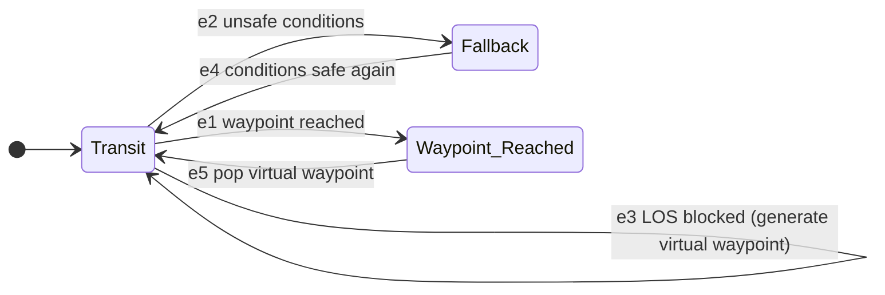

# colav-automaton

[](https://pypi.org/project/colav-automaton)
[](https://pypi.org/project/colav-automaton)

-----

| Field         | Value        |
|---------------|--------------|
| Last Updated  | 2026-08-18   |
| Version       | 1.0.6        |

## Overview

`colav-automaton` is a maritime **col**lision **av**oidance hybrid automaton, built on the [hybrid-automaton](https://github.com/rymc-dev/hybrid-automaton) framework. It steers an autonomous surface vehicle (USV) toward a goal waypoint while avoiding a dynamically-updatable **unsafe region** (a risk envelope, built upstream by [riskenv](https://github.com/rymc-dev/riskenv) from nearby ships' CPA/TCPA geometry), generating temporary "virtual" avoidance waypoints on the fly rather than requiring a pre-planned path.

As of v1.0.4, waypoint generation is COLREGs-informed: the `colav_automaton.classification` module classifies each nearby ship's encounter geometry (Rule 13 overtaking, Rule 14 head-on, Rule 15 crossing) and weights it by Rule 18 vessel-type right-of-way (from AIS-style type data - sailing, fishing, tanker, etc.), producing a `maneuver_bias` (which side to route around, and how urgently) that overrides the automaton's default geometric "easiest side" heuristic. With multiple ships around, `classify_unsafe_set_obstacles` re-applies the same I1/I2/I3 "of interest" filtering `riskenv` used to build `unsafe_region` before aggregating - a distant ship riskenv itself would ignore can't out-vote a closer, genuine threat - then combines what's left by highest urgency (starboard breaking ties). It still isn't a certified rule-engine - restricted visibility (Rule 19), sound/light signals, and simultaneous multi-vessel priority beyond that highest-urgency-wins rule are out of scope - but it's no longer purely a generic risk-region router either. See [`ROADMAP.md`](./ROADMAP.md) for the full picture.

**Framework Status**: v1.0.6 - Stable API, tested against real `hybrid-automaton>=1.0.0` and `riskenv>=1.0.0`, ready for simulation use and ROS2 integration testing on hardware.

If you have ideas for improvement or want to contribute, please reach out and become a collaborator!

## Table of Contents

- [colav-automaton](#colav-automaton)
  - [Overview](#overview)
  - [Table of Contents](#table-of-contents)
  - [How It Works](#how-it-works)
  - [Installation](#installation)
  - [Usage](#usage)
  - [Practical Use Cases](#practical-use-cases)
  - [Collaborators](#collaborators)
  - [License](#license)

## How It Works

The automaton has 3 discrete states, driven by the agent's continuous state `[x, y, theta, velocity, yaw_rate]`:



- **Transit** - the only "under way" state; always actively steers using line-of-sight (LOS) guidance toward the current waypoint. (Earlier versions split this into separate `Cruise`/`Transition_to_LOS` states purely to gate when LOS correction was "allowed" to run - since LOS control safely subsumes open-loop heading-hold, that split bought nothing and was removed in v1.0.4.) When `los_clear_to_waypoint_guard` finds the direct path to the waypoint blocked by the unsafe region, a **virtual waypoint** is generated ahead of the real goal - if one is already queued from an earlier reroute, it's replaced rather than stacked, so the agent never has to unwind a pile of detours leg by leg - see [`generate_new_virtual_waypoint`](./src/colav_automaton/resets/resets.py) below.
- **Fallback** - entered if the agent's safety-radius circle starts intersecting the unsafe region while turning. Holds current heading/velocity (no active re-planning while too close to danger) until the safety circle clears, then returns to Transit.
- **Waypoint_Reached** - a terminal-ish state hit whenever any waypoint (virtual or goal) is reached within an acceptance radius. If virtual waypoints remain queued, the most recent one is popped and the agent resumes toward the next; otherwise the run ends.

### Virtual waypoint generation

`generate_new_virtual_waypoint` picks which side of the unsafe region to route the new virtual waypoint around:

- **By default** (no ship classification available), it scores the rightmost and leftmost *visible* vertices of the unsafe region by how easy each is to navigate to - a combination of the heading change and the distance required to reach it - and picks the cheaper side, with a starboard tie-break.
- **When `colav_automaton.classification` has classified nearby ships**, its aggregated `maneuver_bias` (`{"side", "urgency"}`, fed in as an `AuxiliaryState`) overrides that geometric default and scales how wide a berth is given, so COLREGs compliance takes priority over convenience. See [Practical Use Cases](#practical-use-cases) and [`scripts/generate_unsafe_set.py`](./scripts/generate_unsafe_set.py) for the full ships-in, maneuver-out pipeline.

Every guard has a corresponding flowchart and input/output truth table under [`docs/guards/`](./docs/guards/), and the shared `ctx: RuntimeContext` data contract used by every guard/reset/invariant/dynamics function is documented in [`docs/architecture/shared_context_data_table.md`](./docs/architecture/shared_context_data_table.md).

## Installation

```console
pip install colav-automaton
```

## Usage

```python
import asyncio
import numpy as np

from colav_automaton import ColavAutomaton
from hybrid_automaton import Automaton, RunResult, ContinuousState, AuxiliaryState

ha: Automaton = ColavAutomaton(
    constant_velocity=2.0,
    safety_radius=30.0,
    acceptance_radius=5,
)

async def run():
    results: RunResult = await ha.activate(
        initial_continuous_state=ContinuousState(
            name="agent_state",
            x0=np.array([0.0, 0.0, 0.0, 0.0, 0.0]),
            x_labels=["x", "y", "theta", "velocity", "yaw_rate"],
        ),
        initial_auxiliary_states=[
            AuxiliaryState(name="waypoints", aux0=[180.0, 140.0], aux_buffer_len=10),
            AuxiliaryState(
                name="unsafe_region",
                aux0=[[40.0, 20.0], [80.0, 20.0], [80.0, 60.0], [40.0, 60.0]],
                aux_buffer_len=10,
            ),
        ],
        delta_time=0.1,
        enable_real_time_mode=False,
        enable_self_integration=True,
        should_write_logs=True,
        output_dir="./colav-automaton-logs",
    )
    print(results)

asyncio.run(run())
```

A runnable version of this (with a few example scenarios) is in [`scripts/run_demo_scenario.py`](./scripts/run_demo_scenario.py).

## Practical Use Cases

**Is this ready for real-world use?** As of v1.0.6 it's ready for simulation and ROS2 integration/hardware-in-the-loop testing - it hasn't yet been validated on a physical vessel.

### Key Applications

- **🚢 USV Navigation** - the original motivating use case: risk-envelope-aware waypoint following for unmanned surface vehicles.
- **⚓ COLREGs-informed avoidance** - feed AIS-style ship contacts (position, heading, speed, vessel type) through `colav_automaton.classification` and `riskenv` to get both the risk envelope and a give-way/stand-on maneuver decision; see [`scripts/generate_unsafe_set.py`](./scripts/generate_unsafe_set.py) for the full pipeline.
- **🛰️ ROS2 Integration** - built on `hybrid-automaton`'s ROS2-ready design; unsafe regions, waypoints, and maneuver bias are just `AuxiliaryState` updates, so they can be wired to a live perception/AIS stack.
- **🎓 Research & Education** - hybrid systems / marine autonomy coursework, COLREGs-adjacent research.

### What's Deliberately Out of Scope (for now)

See [`ROADMAP.md`](./ROADMAP.md) for the full list - notably, `colav_automaton.classification` covers Rules 13/14/15/17/18 geometrically and by vessel type, but not restricted visibility (Rule 19), sound/light signals, or simultaneous multi-vessel priority beyond highest-urgency-wins.

## Collaborators

This project was created by:
- **[Ryan McKee](https://github.com/rymc-dev)**

### Contributing

Please open an issue or pull request on [GitHub](https://github.com/rymc-dev/colav-automaton).

### Citation

Please cite this package as described below if used in research:

```bibtex
@misc{colav_automaton_2026,
  author       = {Ryan McKee},
  title        = {colav-automaton v1.0.6},
  howpublished = {GitHub repository},
  year         = {2026},
  note         = {Accessed: Aug. 10, 2026},
  url          = {https://github.com/rymc-dev/colav-automaton}
}
```

## License

`colav-automaton` is distributed under the terms of the [MIT](https://spdx.org/licenses/MIT.html) license.
